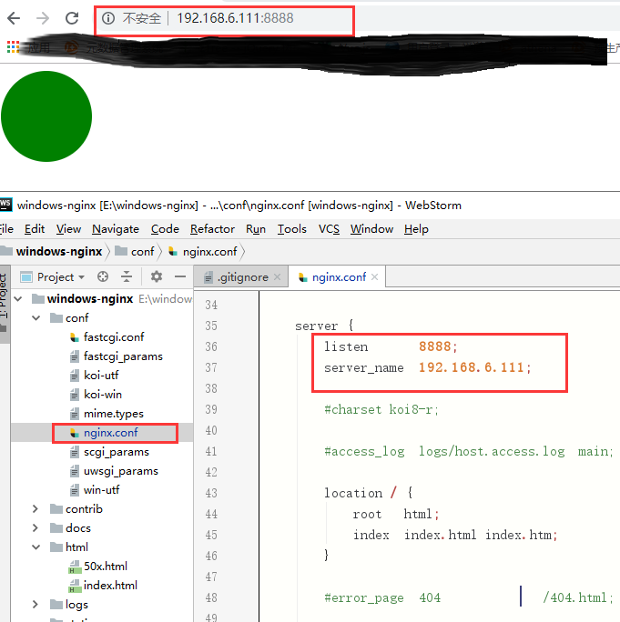
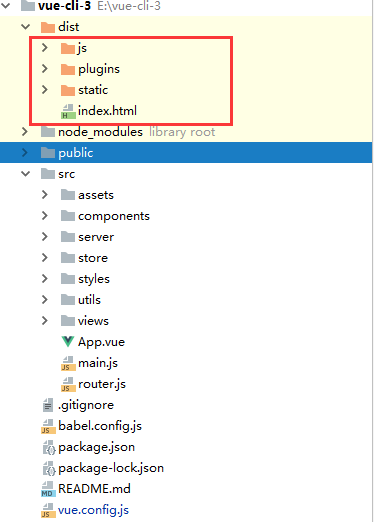
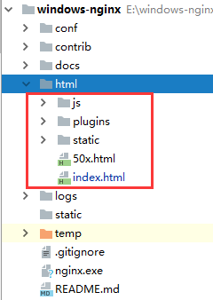

[http://nginx.org/en/download.html](http://nginx.org/en/download.html)

demo示例： 29号前端组 windows-nginx 项目

Nginx官网提供了三个类型的版本：

 - Mainline version：Mainline 是 Nginx 目前主力在做的版本，可以说是开发版
 - Stable version：最新稳定版，生产环境上建议使用的版本
 - Legacy versions：遗留的老版本的稳定版

使用：

 - 直接双击 nginx.exe，一个黑色的弹窗闪过，即启动；
 - 也可cmd 切换到Nginx目录下，启动服务 start nginx；
 - 在浏览器页面输入 localhost ，进入欢迎页面即启动成功；
 - 默认打开的是 html 文件夹中的 index.html；
 - 配置Nginx，conf 目录的 nginx.conf 文件；
 
 
 - 对29号特工组项目 vue-cli3-web 进行打包，将打包之后dist中的文件放入html文件夹中，
 
 
 

 
 - 修改配置后重新加载生效，执行 nginx -s reload；
 - 重新打开日志文件，执行 ginx -s reopen；
 - 检查是否启动成功，执行 tasklist /fi "imagename eq nginx.exe"；
 - 快速停止或关闭，执行 nginx -s stop；
 - 正常停止或关闭，执行 nginx -s quit；
 - 静态资源放在如下配置的 /nginx-1.12.2/static 目录下，新建 static 文件夹；
 - 修改 nginx.conf 文件，静态资源配置只能放在 location / 中；
 
